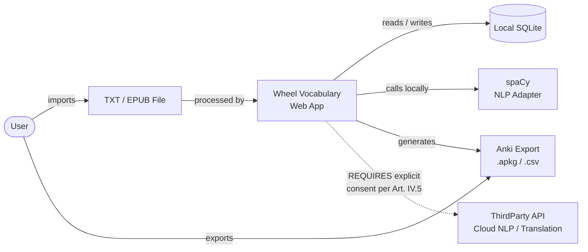
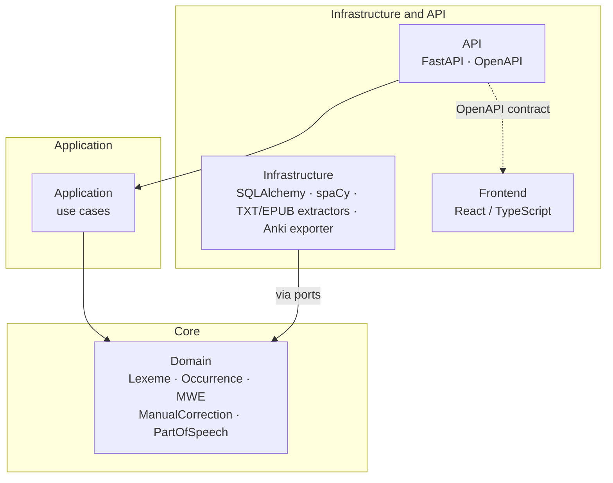
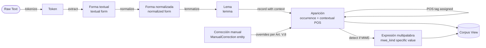

# Architecture Baseline — wheel-of-words

**Date**: 2026-07-16
**Status**: Committed

## Purpose

This document is a committed-state snapshot of the architectural decisions in force as of 2026-07-16. It captures what is decided and will not change without an explicit ADR amendment. It is distinct from `docs/architecture/overview.md`, which is the living, forward-looking architecture reference and may include aspirational or evolving elements.

The baseline is a subset of the overview: it names only what is committed. The overview names what is intended. Both link to each other.

## Relationship to overview.md

| Document | Role | Update policy |
|----------|------|---------------|
| `architecture-baseline.md` (this file) | Point-in-time commitment snapshot | Changed only via ADR amendment |
| `docs/architecture/overview.md` | Living reference, forward-looking | Updated as decisions evolve |

## Committed invariants

The following invariants are in force as of 2026-07-16. Each is grounded in the binding artifact indicated. No implementation may contradict these invariants without a superseding ADR.

| Invariant | Grounding |
|-----------|-----------|
| Local-first processing; no third-party data egress by default | Constitution Art. IV.4–5; [ADR-0005](../adr/0005-local-first.md) |
| Hexagonal split: `domain` / `application` / `infrastructure` / `api` | AGENTS.md §5; Constitution Art. VII.1–4; [ADR-0002](../adr/0002-hexagonal-split.md) |
| SQLite as MVP persistence layer (replaceable via SQLAlchemy port) | [ADR-0001](../adr/0001-monorepo-and-stack.md) |
| spaCy as first NLP adapter (replaceable via `LinguisticAnalyzer` port) | [ADR-0001](../adr/0001-monorepo-and-stack.md); `overview.md §8` |
| Manual corrections take precedence over automatic results; reprocessing is non-destructive | Constitution Art. V.8–9; [ADR-0007](../adr/0007-manual-corrections-precedence.md) |
| POS assigned per occurrence; no single global POS per lemma | Constitution Art. V.2–3; [ADR-0006](../adr/0006-pos-per-occurrence.md) |
| Multiword expressions modeled as language-specific instances; phrasal verbs are the English instance; MWEs stored separately from single-word lemmas | Constitution Art. V.6; [ADR-0008](../adr/0008-multi-language-scope.md); [ADR-0009](../adr/0009-mwe-language-specific-instances.md) |
| Automatic results store provenance (source, version, date, confidence) | Constitution Art. V.7; AGENTS.md §4 |
| Linguistic rules MUST NOT be duplicated in the frontend | Constitution Art. VII.5; AGENTS.md §5 |

## System context diagram

The diagram below shows Wheel Vocabulary in its deployment context as of the committed baseline. All processing is local. No cloud services are present in the default configuration.

> MVP scope. No cloud services active by default. All NLP processing runs on the user's machine (ADR-0005). Egress to `ThirdPartyAPI` requires explicit user consent per Constitution Art. IV.5.

## Hexagonal layers diagram

The diagram below shows the dependency direction among the four backend layers and the ports/adapters at the infrastructure boundary.

> `Domain` has zero dependencies on frameworks (no FastAPI, SQLAlchemy, spaCy imports). All I/O crosses ports at the domain boundary. Infrastructure adapters implement domain ports; they do not inherit from domain entities.

## Linguistic data flow diagram

The diagram below shows how raw text travels through the pipeline to produce the corpus model, and how manual corrections and MWE detection intersect with that flow.

> POS is stored per occurrence (ADR-0006). Manual corrections survive reprocessing (ADR-0007) — `ManualCorrection` wins over the automatic result for the same (occurrence, field) pair. MWE detection produces language-specific `mwe_kind` values: `"phrasal_verb"` for English, `"locución_verbal"` / `"perífrasis_verbal"` for Spanish, `"trennbares_verb"` for German, and so on (ADR-0009).

## What is deferred

The following are intentionally out of scope for the committed baseline. They require future ADRs before implementation:

- Language detection strategy (OQ-2)
- Per-language NLP library selection beyond spaCy English (OQ-4)
- Translation provider consent model (OQ-3)
- Manual-corrections UX shape: day-one vs deferred correction queue (OQ-1)
- EPUB extraction adapter
- Background job processing (async task queue)
- Authentication and multi-user support

## References

- [`docs/architecture/overview.md`](overview.md) — living architecture reference
- [`docs/adr/README.md`](../adr/README.md) — full ADR index
- [`docs/constitution.md` Art. VII](../constitution.md#artículo-vii--arquitectura)
- [`AGENTS.md §5 — Arquitectura`](../../AGENTS.md#5-arquitectura)
- [`docs/glossary.md`](../glossary.md) — domain term definitions
